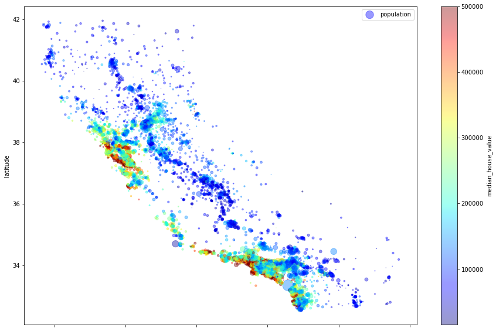
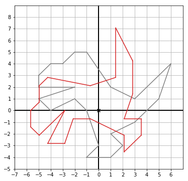
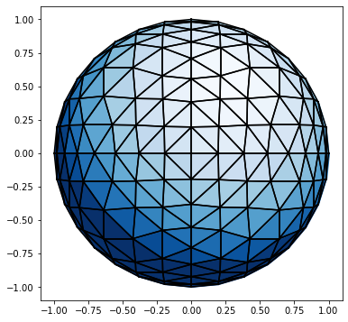

## Machine Learning Series

### This will be a series of my machine learning journey

#### Contents
1. Housing Price Forecast(First test Project!)

2. Math Foundations with Python
* 2D Vectors  
  
* 3D Vectors  
  
* Linear Algebra  
* Statistics  
More content will come soon!